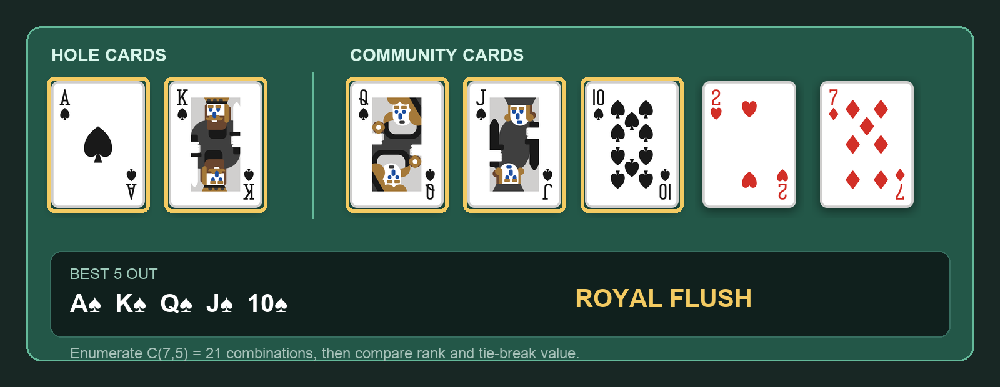
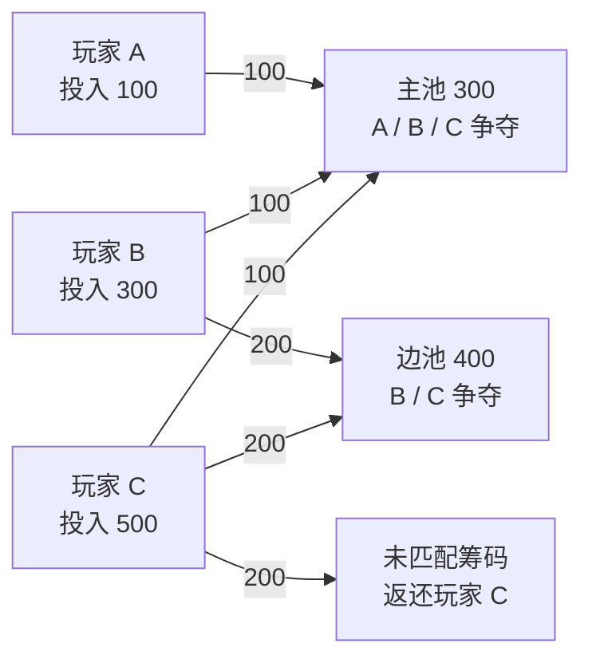
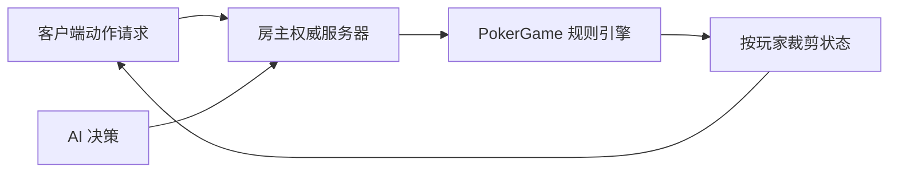

最近我用 Godot 4.7 和 GDScript 做了一款 2D 德州扑克游戏。它最初的目标很直接：几个人在同一局域网里，不需要注册账号，也不依赖公网服务器，打开游戏就能组一桌牌局。人数不够时，还可以添加 AI 玩家。

最终项目支持最多 10 名真人与 AI 同桌，包含 Pre-Flop、Flop、Turn、River、Showdown 的完整流程，也实现了主池与边池结算、断线重连、旁观席、聊天、行动确认、底牌隐藏、动画音效和本地数据统计。

真正做完之后，我发现德州扑克很适合拿来练习游戏架构。它看起来只是发牌和下注，实际却同时包含状态机、组合计算、多人同步、权限隔离和大量边界条件。下面记录一些这次开发中最值得复用的经验。

## 先把牌局写成独立的规则引擎

项目使用 Godot，但核心牌局并没有直接写在 UI 节点里。`PokerGame` 负责玩家、牌堆、下注、底池和阶段推进，界面只监听信号并展示结果。

牌局阶段被定义成一个明确的状态机：

```gdscript
enum GamePhase {
    WAITING,
    PRE_FLOP,
    FLOP,
    TURN,
    RIVER,
    SHOWDOWN,
    HAND_OVER
}
```

每次玩家行动后，规则层会检查下注轮是否结束、牌局是否只剩一名有效玩家，以及是否应该发出下一张公共牌。阶段变化、轮到谁行动、底池更新等结果都通过信号通知界面。

这种分层有两个直接好处。第一，规则可以在没有场景和动画的情况下单独测试；第二，联机时服务端和客户端可以复用同一套数据结构，不需要从 UI 状态反推牌局状态。

我的体会是：回合制游戏不要让按钮决定规则。按钮只应该提交“弃牌”“跟注”或“下注”这样的意图，动作是否合法、应该扣多少筹码，必须由规则层统一判断。

## 七张牌评估，先选择再比较

德州扑克需要从两张底牌和五张公共牌中选出最好的五张组合。这里没有使用复杂的查表算法，而是枚举七张牌中的所有五张组合，分别计算牌型，再选出最大的结果。



上图使用项目中的实际牌面资源：两张底牌与五张公共牌组成七张候选牌，金色描边标出了最终构成皇家同花顺的五张牌。

七选五一共只有 21 种组合，对这个规模的局域网游戏来说完全足够，而且实现容易验证：

```gdscript
for i in range(n):
    for j in range(i + 1, n):
        for k in range(j + 1, n):
            for l in range(k + 1, n):
                for m in range(l + 1, n):
                    var five = [cards[i], cards[j], cards[k], cards[l], cards[m]]
                    var result = evaluate_five_cards(five)
                    if result.rank > best_rank or \
                        (result.rank == best_rank and result.value > best_value):
                        best_rank = result.rank
                        best_value = result.value
```

五张牌的结果拆成 `rank` 和 `value` 两部分。`rank` 表示高牌、一对、两对、顺子、同花等牌型等级，`value` 则用来解决同一牌型之间的大小比较。例如一对会把对子和三张踢脚牌按十六进制位编码，从而直接使用整数完成比较。

这里最容易漏掉的边界是 A-2-3-4-5。A 通常是最大点数，但在这个顺子中必须按 5 作为最高牌处理。如果没有为 wheel 单独判断，牌型测试很容易在这里出错。

## 全押真正难在边池，不在牌型

牌型比较写完之后，最复杂的部分其实是多人全押。

假设三名玩家分别投入 100、300 和 500 筹码，不能简单把 900 筹码当成一个底池发给最终牌型最大的玩家。正确做法是根据每个人的累计投入切成多层：所有人都参与第一层，后两人参与第二层，最后一人的多余投入如果无人匹配则直接返还。



项目中的实现先收集所有不同的累计投入额度，然后逐层计算：

```gdscript
for level in levels:
    var funding_players = contributors.filter(
        func(p): return p.total_contribution >= level
    )
    layers.append({
        "amount": (level - previous_level) * funding_players.size(),
        "eligible_players": eligible_ids,
        "contributor_ids": contributor_ids,
        "contributor_count": funding_players.size(),
    })
    previous_level = level
```

每一层都有自己的出资者和获奖资格。已经弃牌的人仍然贡献筹码，但不能参与该层胜负；只有一个出资者的层属于未匹配投入，应该返还而不是进入奖池。多人平分时如果出现余数，则按座位顺序分配，保证结果可重复。

这个问题给我的启发是：不要直接针对“主池、边池一、边池二”写分支。把下注抽象成贡献层后，无论有多少人以多少筹码全押，都可以使用同一套结算逻辑。

另外，这个项目为了朋友聚会加入了一个自定义的零筹码救济机制：从赢家净收益中拿出 10%，分给结算后仍为零筹码的在座玩家。它不是标准赌场规则，而是为了避免有人过早出局。规则引擎把这一步放在正常底池结算之后，并且只对净收益计算，返还的未匹配筹码不会被扣除。

## 联机的核心是权威与权限

网络部分使用 Godot 的 `ENetMultiplayerPeer`，采用 Listen Server 架构。房主既是玩家，也是唯一维护真实牌局状态的权威服务器。其他玩家只发送动作请求，不直接修改筹码、底池或牌堆。

基本数据流可以概括为：



“同步状态”并不意味着把同一份对象广播给所有人。服务端序列化时会接收 `viewer_id`：玩家只能看到自己的底牌，其他人的底牌只保留数量；牌堆顺序只存在于权威状态中。到 Showdown 或房主选择公开手牌时，才根据规则解除隐藏。

```gdscript
var reveal_cards = (
    viewer_id < 0
    or player.id == viewer_id
    or (current_phase == GamePhase.SHOWDOWN and player.is_active)
)
```

这比客户端收到全部数据后自行隐藏更可靠。只要秘密数据曾经到达客户端，就不能再把它当成秘密。

为了减少局域网波动带来的问题，每个动作还带有递增序列号。客户端在超时未收到确认时最多重发三次，服务端记录每名玩家最后接受的序列号，从而避免同一个下注动作执行两遍。断线后，玩家使用重连令牌恢复身份；服务器会暂存其筹码和座位 5 分钟，如果原座位已经被占用，则以旁观者身份回来。

这部分让我意识到，多人游戏最重要的不是让画面同时变化，而是回答三个问题：谁有权修改状态、每个人允许看到什么、重复或迟到的消息如何处理。

## AI 不必一开始就追求最优

游戏中的 AI 是启发式策略，而不是求解器。它会估算起手牌或当前成牌强度，结合跟注成本、底池赔率、激进程度和少量随机诈唬概率，在弃牌、过牌、跟注、下注和全押之间选择。

这种实现不一定能打出专业牌手的策略，但很适合本项目的目标：让单人测试可以随时开局，也让朋友人数不足时牌桌仍然完整。更重要的是，它的决策过程可解释，出现异常行为时容易定位阈值，而不是面对一个难以调试的黑盒。

如果以后继续迭代，我会优先补充听牌概率、位置因素和对手下注历史，再考虑蒙特卡洛模拟，而不是直接把复杂度推到很高。

## 动画可以延迟，结果不能延迟

牌桌 UI 负责座位布局、倒计时、按钮状态、发牌动画和筹码飞行动画。规则层先产生确定结果，界面再播放表现层动画。这样即使某个客户端掉帧或跳过动画，也不会影响牌局本身。

项目还通过 `ConfigFile` 和 JSON 保存玩家资料与最近三次房间会话，统计手牌数、胜局、胜率和筹码变化。音效则由全局 `AudioManager` 管理，Master 与 SFX 音量分开控制。

这些功能不是规则核心，却决定了游戏是否像一个完整产品。尤其是行动倒计时、操作日志和筹码动画，它们都在告诉玩家“刚才发生了什么”，能显著降低多人牌局中的困惑。

## 测试应该盯住不变量

德州扑克的组合情况太多，不可能只靠手动开几局确认正确。项目为规则状态和网络同步写了无界面测试，并额外启动房主、普通客户端与晚加入客户端进行网络集成测试。

我认为最有价值的测试不是逐行覆盖，而是验证系统不应该破坏的不变量：

- 所有玩家筹码与待分配底池的总量必须守恒。
- 未匹配的全押筹码必须回到原出资者手中。
- 盲注必须按真实座位顺时针轮换，而不是按玩家加入顺序轮换。
- 客户端不能收到别人的隐藏底牌，也不能收到牌堆顺序。
- 同一个网络动作即使重传，也只能执行一次。
- 断线重连后，身份、筹码和座位状态必须连续。

边池测试中，我会直接构造一名短筹码玩家投入 600、另一名深筹码玩家投入 1000 的状态，确认短筹码获胜时只能赢取被匹配的部分，而多出的 400 必须返还。相比从 UI 一步步下注，这样的测试更快，也更容易精确覆盖边界。

## 最后的复盘

这次项目让我更加确信，复杂游戏规则的开发顺序很重要：先建立独立、可测试的状态机，再做牌型和结算；先确定权威状态与数据权限，再接网络；最后才让动画、音效和统计围绕稳定的规则层生长。

如果反过来先把牌桌画出来，再往按钮回调里堆规则，单机阶段可能还能运行，一旦加入全押、断线和多人同步，复杂度会迅速失控。

目前这个项目主要面向可信局域网，不包含公网大厅、NAT 穿透、账号系统或专用服务器。它离商业化德州扑克还有很远，但作为一次完整的 Godot 多人游戏实践，它已经覆盖了从规则建模到网络可靠性、从 UI 反馈到自动化测试的一整条开发链路。对我来说，这比单纯“做出一局能玩的牌”更有价值。
